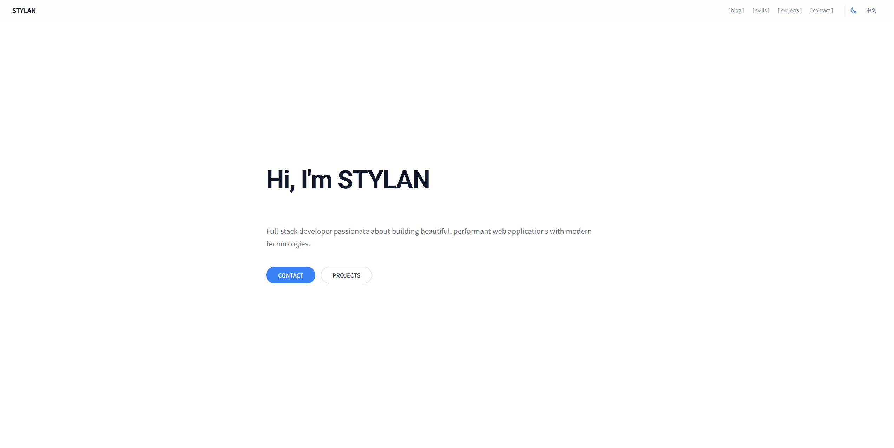

# STYLAN Developer Portfolio

简约现代风格的程序员个人主页，支持浅色/深色主题切换、中英文切换，以及 Markdown 博客系统。



## 技术栈

- **前端框架**：React 19
- **构建工具**：Vite
- **样式方案**：Tailwind CSS v4
- **路由**：React Router v7
- **字体**：Geist Pixel + Geist Mono
- **Markdown**：react-markdown + rehype-highlight + remark-gfm

## 快速开始

```bash
# 安装依赖
pnpm install

# 启动开发服务器
pnpm run dev

# 构建生产版本
pnpm run build

# 预览生产版本
pnpm run preview
```

## 项目结构

```txt
├── public/
│   ├── fonts/                    # 字体文件
│   ├── favicon.svg               # 网站图标
│   └── icons.svg                 # 图标集
├── src/
│   ├── config.js                 # 主站配置文件
│   ├── blogConfig.js             # 博客配置文件
│   ├── index.css                 # 全局样式和主题
│   ├── App.jsx                   # 路由配置
│   ├── main.jsx                  # 应用入口
│   ├── pages/                    # 页面组件
│   │   ├── HomePage.jsx          # 主页
│   │   ├── BlogPage.jsx          # 博客列表页
│   │   └── BlogPostPage.jsx      # 博客文章详情页
│   ├── components/               # 按页面分类的组件
│   │   ├── HomePage/             # 主页组件
│   │   │   ├── Header.jsx        # 导航栏
│   │   │   ├── Hero.jsx          # 个人介绍
│   │   │   ├── Skills.jsx        # 技能展示
│   │   │   ├── Projects.jsx      # 项目展示
│   │   │   ├── Contact.jsx       # 联系方式
│   │   │   ├── Footer.jsx        # 页脚
│   │   │   ├── AnimatedText.jsx  # 动画文字
│   │   │   └── PageTitle.jsx     # 页面标题
│   │   └── BlogPage/             # 博客组件
│   │       ├── BlogHeader.jsx    # 博客导航
│   │       ├── BlogHero.jsx      # 博客标题
│   │       ├── CategoryFilter.jsx # 分类筛选
│   │       ├── BlogList.jsx      # 文章列表
│   │       ├── BlogPost.jsx      # 文章卡片
│   │       └── BlogFooter.jsx    # 博客页脚
│   ├── posts/                    # 博客文章（中文）
│   │   ├── en/                   # 博客文章（英文）
│   │   ├── 2026-04-25-getting-started-with-react-hooks.md
│   │   ├── 2026-04-20-building-modern-portfolio.md
│   │   └── 2026-04-15-my-journey-into-web-development.md
│   ├── hooks/                    # 自定义 Hooks
│   │   ├── useTheme.js           # 主题切换
│   │   └── useLanguage.js        # 语言切换
│   └── utils/                    # 工具函数
│       └── markdown.js           # Markdown 解析
└── vite.config.js                # Vite 配置
```

## 配置说明

### 主站配置（src/config.js）

```js
const config = {
  site: {
    title: "STYLAN",
    pageTitle: "STYLAN - Developer Portfolio",
    favicon: "/favicon.svg",
  },
  personal: {
    name: { en: "STYLAN", zh: "STYLAN" },
    avatar: "👨‍💻",
    title: { en: "Hi, I'm STYLAN", zh: "你好，我是STYLAN" },
    bio: { en: "Full-stack developer...", zh: "全栈开发者..." },
  },
  navLinks: [
    { href: "/blog", label: { en: "Blog", zh: "博客" } },
    { href: "#skills", label: { en: "Skills", zh: "技能" } },
    { href: "#projects", label: { en: "Projects", zh: "项目" } },
    { href: "#contact", label: { en: "Contact", zh: "联系" } },
  ],
  // ... 更多配置
};
```

### 博客配置（src/blogConfig.js）

```js
const blogConfig = {
  page: {
    title: { en: "Blog", zh: "博客" },
    subtitle: {
      en: "Thoughts, tutorials and insights",
      zh: "想法、教程与见解",
    },
  },
  categories: [
    { id: "all", label: { en: "All", zh: "全部" } },
    { id: "tech", label: { en: "Technology", zh: "技术" } },
    { id: "tutorial", label: { en: "Tutorials", zh: "教程" } },
  ],
};
```

## 博客系统

### 创建新文章

在 `src/posts/` 目录下创建 Markdown 文件：

**文件命名规范**：`yyyy-mm-dd-post-title.md`

**中文文章**：`src/posts/2026-05-01-my-new-post.md`
**英文文章**：`src/posts/en/2026-05-01-my-new-post-en.md`

### 文章格式

````markdown
---
title:
  en: "English Title"
  zh: "中文标题"
excerpt:
  en: "English excerpt"
  zh: "中文摘要"
category: "tutorial"
readTime:
  en: "5 min read"
  zh: "5 分钟阅读"
author:
  en: "Author Name"
  zh: "作者名称"
tags: ["React", "JavaScript"]
featured: true
---

## 文章正文内容

这里是 Markdown 格式的正文内容...

### 代码块

```javascript
function hello() {
  console.log("Hello, World!");
}
```
````

### 支持的分类

- `tech` - 技术文章
- `tutorial` - 教程
- `thoughts` - 想法/随笔
- `project` - 项目相关

## 功能特性

### 主题切换

- 点击导航栏右侧的太阳/月亮图标切换主题
- 主题偏好自动保存到 localStorage
- 首次访问时跟随系统主题
- 代码块支持 Everforest Dark（深色）/ One Light（浅色）配色

### 语言切换

- 点击导航栏右侧的「中文」/「EN」按钮切换语言
- 语言偏好自动保存到 localStorage
- 博客文章根据语言自动切换中英文版本

### 博客功能

- Markdown 渲染（支持 GFM 语法）
- 代码语法高亮（Dracula 主题）
- Mac 风格代码块
- 文章分类筛选
- 响应式布局

## 自定义样式

编辑 `src/index.css` 修改主题色：

```css
body {
  background-color: #ffffff; /* 浅色模式背景 */
  color: #111827; /* 浅色模式文字 */
}

.dark body {
  background-color: #0f172a; /* 深色模式背景 */
  color: #f1f5f9; /* 深色模式文字 */
}

::selection {
  background-color: #3b82f6; /* 选中文字高亮色 */
}
```

## 部署

### Vercel

```bash
# 安装 Vercel CLI
npm i -g vercel

# 部署
vercel
```

### Netlify

1. 将代码推送到 GitHub
2. 在 Netlify 中导入项目
3. 设置构建命令：`pnpm run build`
4. 设置发布目录：`dist`

### GitHub Pages

```bash
# 构建
pnpm run build

# 部署到 GitHub Pages
# 将 dist 目录推送到 gh-pages 分支
```

## License

MIT
