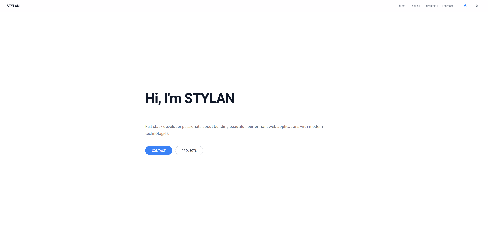

# STYLAN Developer Portfolio

简约现代风格的程序员个人主页：支持浅色/深色主题、中英文切换，以及基于 Markdown 文件的博客系统。

- **线上地址**：https://duan-deqing.github.io
- **当前版本**：1.5.4



## 技术栈

| 类别 | 选型 |
|------|------|
| 前端框架 | React 19 |
| 构建工具 | Vite 8 |
| 样式方案 | Tailwind CSS v4（`@tailwindcss/vite`） |
| 路由 | React Router v7 |
| Markdown | react-markdown + remark-gfm + rehype-highlight |
| Frontmatter | front-matter |
| RSS | feed（`scripts/generate-rss.js`） |
| 包管理 | pnpm |
| 部署 | GitHub Pages（Actions 自动构建） |

字体：Noto Sans SC（Google Fonts）+ Roboto / Merriweather / Fira Code Nerd Font（本地 `public/fonts`）。

## 快速开始

```bash
# 安装依赖
pnpm install

# 启动开发服务器
pnpm run dev

# 生成 RSS（也会在 build 时自动执行）
pnpm run rss

# 构建生产版本（先生成 rss.xml，再 vite build）
pnpm run build

# 预览生产版本
pnpm run preview
```

## 项目结构

```txt
├── .github/workflows/deploy.yml  # GitHub Pages 自动部署
├── public/
│   ├── fonts/                    # 本地字体
│   ├── images/                   # 图片资源
│   ├── favicon.ico
│   ├── 404.html                  # GitHub Pages SPA 重定向兜底
│   ├── .nojekyll
│   └── rss.xml                   # RSS（由脚本生成，勿手改）
├── scripts/
│   └── generate-rss.js           # 构建时生成 RSS
├── src/
│   ├── main.jsx                  # 入口（BrowserRouter）
│   ├── App.jsx                   # 路由与懒加载
│   ├── config.js                 # 主站内容配置（改这里自定义站点）
│   ├── blogConfig.js             # 博客页面与分类配置
│   ├── theme.js                  # Tailwind 类名颜色映射
│   ├── index.css                 # 全局样式、字体、深色模式
│   ├── pages/                    # 页面组件
│   ├── components/
│   │   ├── shared/               # Header / Footer / Title / Loading
│   │   ├── HomePage/             # Hero、技能、项目、博客精选、动画
│   │   └── BlogPage/             # 列表、搜索、筛选、目录
│   ├── posts/                    # 中文文章 Markdown
│   │   ├── en/                   # 英文文章
│   │   └── img/<文章名>/          # 文章配图
│   ├── hooks/                    # useTheme / useLanguage
│   ├── styles/blog-post.css      # 文章页专属样式
│   └── utils/markdown.js         # 读取/解析 Markdown
├── index.html                    # 含 SPA 重定向脚本
└── vite.config.js
```

## 路由

| 页面 | 路由 | 说明 |
|------|------|------|
| 主页 | `/` | 个人介绍、技能、项目、博客精选、联系 |
| 技能 | `/skills` | 技能分类与技术栈 |
| 项目 | `/projects` | 项目作品 |
| 博客 | `/blog` | 文章列表（搜索 Ctrl/Cmd+K、分类筛选） |
| 文章详情 | `/blog/:slug` | Markdown 渲染 + 侧边目录 |
| 联系 | `/contact` | 联系方式、微信二维码、简历下载 |
| 404 | `*` | 未匹配路径 |

## 配置说明

日常维护**只需要改配置文件和文章**，一般不用动组件代码。

### 主站配置 `src/config.js`

可改内容：站点标题、个人信息、导航、Hero 右侧动画、技能、项目、联系、社交链接、页脚版权。

多语言字段统一写成 `{ en: "...", zh: "..." }`；不参与切换的写成普通字符串。

Hero 右侧 `personal.heroRight.type` 可选：

- `wave` — Perlin 噪声波浪（默认）
- `dots` — 点阵
- `rays` — 光线
- `image` / `svg` / `code`

### 博客配置 `src/blogConfig.js`

分类 id 必须与文章 frontmatter 的 `category` **完全一致**（小写）：

| id | 中文标签 | 英文标签 |
|----|----------|----------|
| `tech` | 技术 | Technology |
| `tutorial` | 教程 | Tutorials |
| `thoughts` | 想法 | Thoughts |
| `project` | 项目 | Projects |

> 注意：文章里不要写 `Tutorials`、`Technology` 这类展示文案，要写 id（如 `tutorial`），否则分类筛选点不出来。

### 主题 `src/theme.js`

用 Tailwind 类名描述各区域 light/dark 颜色；真正生效还需 `index.css` 的 `@custom-variant dark`。

## 写博客

### 文件命名

- 中文：`src/posts/yyyy-mm-dd-post-title.md`
- 英文：`src/posts/en/yyyy-mm-dd-post-title-en.md`
- 配图：`src/posts/img/yyyy-mm-dd-post-title/xxx.jpg`（文件夹名与文章文件名去掉日期前缀后的 slug 对应更稳妥时，请与 `utils/markdown.js` 的匹配规则一致：文件夹名 = 文章文件名去掉 `-en`）

### Frontmatter 模板

```markdown
---
title:
  en: "English Title"
  zh: "中文标题"
excerpt:
  en: "English excerpt"
  zh: "中文摘要"
category: "tutorial"          # 必须是 blogConfig 里的 id
readTime:
  en: "5 min read"
  zh: "5 分钟阅读"
author:
  en: "STYLAN"
  zh: "STYLAN"
tags: ["React", "JavaScript"]
featured: true                # true 会出现在主页「最新文章」优先展示
---

# 正文从这里开始

支持 GFM 表格、任务列表、代码块语法高亮。
```

正文里的第一个 `# 一级标题` 会被自动去掉，避免和页面标题重复。

## 功能特性

- **主题切换**：导航栏太阳/月亮按钮；偏好写入 `localStorage`，首次访问跟随系统
- **语言切换**：导航栏「中文 / EN」；博客中英文分目录存放，切换语言会重新加载对应版本
- **博客搜索**：博客页 `Ctrl/Cmd + K`，按标题/摘要/标签/分类过滤
- **文章目录**：桌面端左侧浮动 TOC，基于 h2–h4
- **代码块**：Mac 风格窗口 + rehype-highlight 高亮
- **动画**：Wave / Dots / Rays / 打字机标题
- **RSS**：`pnpm run rss` 或 build 时生成 `public/rss.xml`
- **GitHub Pages SPA**：`public/404.html` + `index.html` 内重定向脚本（spa-github-pages 方案）

## 部署

### GitHub Pages（仓库已配置）

推送 `main` 后，`.github/workflows/deploy.yml` 会：

1. 安装 pnpm 9 + Node 20  
2. `pnpm install --frozen-lockfile`  
3. `pnpm run build`（含 RSS）  
4. 上传 `dist/` 并发布到 GitHub Pages  

本地不要提交 `dist/`（构建产物由 CI 生成）。若工作区里已有被跟踪的 `dist`，建议：

```bash
git rm -r --cached dist
```

并在 `.gitignore` 中增加 `dist`。

### Vercel / Netlify

- 构建命令：`pnpm run build`
- 输出目录：`dist`

## 可用脚本

| 命令 | 作用 |
|------|------|
| `pnpm dev` | 开发服务器 |
| `pnpm build` | 生成 RSS + 生产构建 |
| `pnpm preview` | 预览 `dist` |
| `pnpm rss` | 仅重新生成 `public/rss.xml` |
| `pnpm lint` | ESLint（仓库目前**未附带** eslint 配置与依赖，需自行补上才能用） |

## License

MIT
