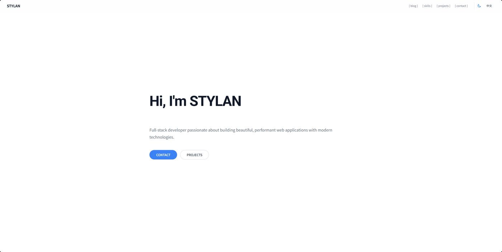
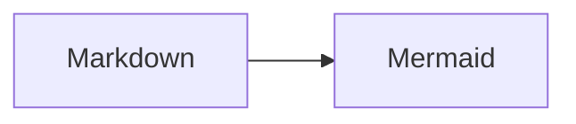

# STYLAN Developer Portfolio

简约现代风格的程序员个人主页：支持浅色/深色主题、中英文切换，以及基于 Markdown 文件的博客系统。

- **线上地址**：https://duan-deqing.github.io
- **当前版本**：1.6.0



## 技术栈

| 类别 | 选型 |
|------|------|
| 前端框架 | React 19 |
| 构建工具 | Vite 8 |
| 样式方案 | Tailwind CSS v4（`@tailwindcss/vite`） |
| 路由 | React Router v7 |
| Markdown | react-markdown + remark-gfm + remark-github-blockquote-alert + remark-breaks + rehype-raw + rehype-sanitize + rehype-highlight |
| 图表 | mermaid（动态 import，按需加载） |
| 图集轮播 | embla-carousel-react |
| Frontmatter | front-matter |
| RSS | feed（`scripts/generate-rss.js`） |
| 包管理 | pnpm |
| 部署 | GitHub Pages（Actions 自动构建） |

字体：自托管 [Geist Sans / Geist Mono](https://vercel.com/font)（`public/fonts/*.woff2`，SIL OFL 1.1），中文回退到 `PingFang SC` / `Microsoft YaHei` 等系统字体；不请求第三方字体服务。

设计：首页参考 [antfu.me](https://github.com/antfu/antfu.me) 的 65ch 文本流，博客/项目/技能/书签与后台参考 [onur.dev](https://github.com/suyalcinkaya/onur.dev) 的侧栏与表格体系；完整令牌与规则见 `DESIGN.md`。

## 快速开始

```bash
# 安装依赖
pnpm install

# 启动开发服务器
pnpm run dev

# 生成 RSS（也会在 build 时自动执行）
pnpm run rss

# 构建生产版本（先生成 rss.xml，再 vite build）
pnpm run build

# 预览生产版本
pnpm run preview
```

## 项目结构

```txt
├── .github/workflows/deploy.yml  # GitHub Pages 自动部署
├── public/
│   ├── fonts/                    # Geist 字体与许可
│   ├── images/                   # 图片资源
│   ├── favicon.ico
│   ├── 404.html                  # GitHub Pages SPA 重定向兜底
│   ├── .nojekyll
│   └── rss.xml                   # RSS（由脚本生成，勿手改）
├── scripts/
│   └── generate-rss.js           # 构建时生成 RSS
├── content/                      # 所有可编辑内容（对标 antfu.me 的 pages 结构）
│   ├── site.yaml                 # 全站共享：站点信息、个人、导航、联系、社交、页脚
│   ├── changelog/                # 版本更新日志：v<版本>-<日期>.<zh|en>.md
│   └── pages/
│       ├── index.en.md           # 首页 / 英文自我介绍（Markdown）
│       ├── index.zh.md           # 首页 / 中文自我介绍（Markdown）
│       ├── home.en.md            # Home 子页英文自我介绍（Markdown）
│       ├── home.zh.md            # Home 子页中文自我介绍（Markdown）
│       ├── projects.yaml         # 项目页文案、分类与项目列表
│       ├── stack.yaml            # Stack 页文案、官网按钮、分类与技术项
│       ├── blog.yaml             # 博客页与分类
│       ├── bookmarks.yaml        # 书签页、分类与书签
│       ├── quotes.yaml           # 空态与项目/Stack/Home 底部随机语录
│       └── posts/
│           ├── zh/               # 中文文章 Markdown
│           ├── en/               # 英文文章 Markdown
│           └── img/<文章名>/      # 文章配图
├── src/
│   ├── main.jsx                  # 入口（BrowserRouter）
│   ├── App.jsx                   # 路由与预加载（仅文章页懒加载）
│   ├── admin/                    # 本地内容后台（仅 dev，不参与构建）
│   ├── index.css                 # 全局样式、字体、深色模式
│   ├── pages/                    # 页面组件
│   ├── layouts/                  # HomeLayout（antfu 首页）/ SubpageLayout（onur 子页）/ BlogLayout / BookmarksLayout
│   ├── backgrounds/              # 可复用背景层：plum / dots / grid / waves / aurora / none
│   ├── components/
│   │   ├── site/                 # 侧栏、移动抽屉、按钮、图标、主题语言、分类标题、页头、ParentLink 与页脚
│   │   ├── blog/                 # 文章表格、筛选、搜索、骨架
│   │   ├── BlogPage/             # 文章 TOC 与 Markdown 渲染组件
│   │   ├── bookmarks/            # 书签分类栏、卡片与网格
│   │   ├── projects/             # 项目条目与网格
│   │   └── shared/               # PageTitle / RichText / ContentCard / ProjectLinkCard / ScrollToTop
│   ├── hooks/                    # useTheme / useLanguage
│   ├── styles/                   # category-heading / stack-list / projects / content-cards / blog-post / bookmarks / rich-text / hover-reveal / glass-dialog（通用液态玻璃弹窗外壳）/ wechat-glass（二维码托盘与微信号胶囊）
│   └── utils/                    # markdown.js 读取/解析文章；projectIcon.js 解析项目图标；liquidGlass.js + liquidGlassMaps.js + liquidGlassWorker.js 在 Worker 中生成折射/高光滤镜
├── index.html                    # 含 SPA 重定向脚本
└── vite.config.js
```

## 路由

| 页面 | 路由 | 说明 |
|------|------|------|
| 主页 | `/` | 个人介绍、技能、项目、博客精选、联系 |
| Home | `/home` | onur 式个人页：Markdown 介绍 + 写作列表 |
| 技术栈 | `/stack` | 按分类展示技术项、介绍与官网入口 |
| 项目 | `/projects` | 按分类分组的 antfu 式项目条目 |
| 更新日志 | `/changelog/:scope` | 按 home / projects / stack 筛选的版本时间线 |
| 博客 | `/blog` | 文章列表（搜索 Ctrl/Cmd+K、分类 + 标签筛选） |
| 文章详情 | `/blog/:slug` | Markdown 渲染 + 侧边目录 |
| 书签 | `/bookmarks` | 分类列表；桌面右侧空态语录 |
| 书签分类 | `/bookmarks/:slug` | onur 式双列书签卡片 |
| 404 | `*` | 未匹配路径 |

## 配置说明

日常维护**只需要改 `content/` 下的配置和文章**，一般不用动组件代码。内容结构参考 antfu.me 的 `pages/` 组织方式，统一放在 `content/`：

| 文件 | 内容 |
|------|------|
| `content/site.yaml` | 站点信息、个人信息、导航、联系方式、社交链接、页脚（全站共享） |
| `content/pages/index.en.md` / `index.zh.md` | 首页 `/` 的中英文自我介绍（Markdown） |
| `content/pages/home.en.md` / `home.zh.md` | Home 子页 `/home` 的中英文自我介绍（Markdown） |
| `content/pages/projects.yaml` | `/projects` 页头文案、顶层 `buttons` 按钮、项目分类与项目列表 |
| `content/pages/stack.yaml` | `/stack`（Stack）页头文案、顶层 `buttons` 官网按钮、分类与技术项（名称 / 双语介绍） |
| `content/pages/blog.yaml` | `/blog` 页头与分类 |
| `content/pages/bookmarks.yaml` | `/bookmarks` 页头、分类与书签 |
| `content/pages/quotes.yaml` | 博客/书签空态与项目/Stack/Home 底部随机语录 |
| `content/pages/posts/` | 中英文文章与配图 |

多语言字段写成 `{ en: "...", zh: "..." }`；不参与切换的写普通字符串。字段说明见 `src/admin/schema.js`；`projects.yaml` 与 `stack.yaml` 的 `page` 字段用于页面标题/描述/介绍，页头按钮统一放在顶层 `buttons`。

### 首页自我介绍

`content/pages/index.en.md` / `index.zh.md` 维护首页 `/` 的自我介绍，`home.en.md` / `home.zh.md` 维护 Home 子页 `/home`。四份文件使用标准 Markdown：空行分隔段落，段内单个换行直接显示为换行，并支持 `**加粗**`、`[文字](链接)` 等语法。站内链接由 React Router `<Link>` 接管（无整页刷新），站外链接新窗口打开。渲染使用 `RichText` 组件（ReactMarkdown + remark-gfm + remark-breaks）与 `.rich-text` 样式：16px/1.75、段块间 1.5rem、粗体 600 + `--heading`；链接复用 `.link` 下划线样式，邮箱链接自动使用等宽字体；每个段落块仍作为首页入场动画的独立子项。

### 项目页按钮 `content/pages/projects.yaml`

顶层 `buttons` 控制页头介绍下方的按钮，数组顺序即展示顺序：

```yaml
buttons:
  - name: GitHub
    link: https://github.com/duan-deqing
    logo: github.svg
    color: "#8250df"   # 可选；不填使用默认强调色
```

- `name` / `link` 必填；`logo` 可写 `public/images/buttons` 下的文件名、站内路径或图片 URL；
- `color` 可选，用于 hover/focus 的文字色与 10% 同色背景；未设置时使用主题强调色；
- 底部“在 GitHub 查看全部项目”自动使用名为 `GitHub` 的按钮链接；
- 新增按钮只需在 `buttons` 中追加一项。

### 项目图标 `public/images/projects/`

项目 `icon` 支持三种写法：

- 文件名，如 `orbit-desk.svg` → `/images/projects/orbit-desk.svg`；新增图标文件后直接写文件名即可；
- 站内路径（`/images/...`）或完整图片 URL；
- 留空 → 使用项目英文名称首字母方牌。

图标按单色遮罩渲染，建议使用透明 SVG 或透明 PNG，以贴合页面风格。

### Stack 配置 `content/pages/stack.yaml`

`page` 维护页头文案，顶层 `buttons` 维护介绍下方的官网按钮（顺序即展示顺序），`categories` 下每个分类依次渲染大号描边标题（与项目页共用 `CategoryHeading` / `.category-head` 样式）。分类中的技术项名称与 `buttons[].name` 相同时，会自动复用该按钮的链接并显示为蓝色箭头链接：

```yaml
page:
  title: { en: Stack, zh: 技术栈 }
  description: { en: "...", zh: "..." }
  intro: { en: "...", zh: "..." }

buttons:
  - name: LangChain
    link: https://python.langchain.com
    logo: langchain.svg
    color: "#22C55E"

  - name: React
    link: https://react.dev
    logo: react.svg
    color: "#0891B2"

categories:
  - id: ai
    label: { en: AI, zh: 人工智能 }
    items:
      - name: LangChain
        description:
          en: Framework for building LLM applications.
          zh: 构建大模型应用的应用框架。
```

- `buttons` 决定页头按钮的名称、链接、logo、颜色与顺序，增删或调整顺序只需改这个列表；`color` 可选，未设置使用主题强调色；
- `id` 只用小写字母、数字和 `-`，用作分类锚点；
- `name` 必填；`description` 可写双语对象或普通字符串，留空则只显示名称；
- 分类中的技术项不再单独配置 `link` / `logo`；与 `buttons[].name` 同名时自动成为蓝色下划线 + ↗ 链接，新窗口打开官网；
- `logo` 可写 `public/images/stack` 下的文件名、站内路径或图片 URL，按钮以 antfu 式 logo + 名称显示；
- 首页 Stack 区块与 `/stack` 页头共用 `StackButtonGroup`，读取同一份顶层 `buttons`，按 YAML 顺序展示 logo + 名称按钮（未设置 `color` 时使用主题强调色）；首页为左对齐换行布局，`/stack` 页头为居中布局。

### 博客配置 `content/pages/blog.yaml`

分类 id 必须与文章 frontmatter 的 `category` 完全一致（小写）：

| id | 中文标签 | 英文标签 |
|----|----------|----------|
| `tech` | 技术 | Technology |
| `tutorial` | 教程 | Tutorials |
| `thoughts` | 想法 | Thoughts |
| `project` | 项目 | Projects |

> 注意：文章里不要写 `Tutorials`、`Technology` 这类展示文案，要写 id（如 `tutorial`），否则分类筛选点不出来。

### 随机语录 `content/pages/quotes.yaml`

`quotes` 下每条包含 `en` / `zh`；进入 `/blog` 或 `/bookmarks` 且未选择条目时，桌面右侧空态会随机显示其中一条；`/projects`、`/stack`、`/home` 页面底部也会随机显示一条。切换语言时显示同一条的对应语言版本。

### 书签配置 `content/pages/bookmarks.yaml`

分类和书签都直接写在这个文件里；改完即生效，无需改组件：

```yaml
page:
  title: { en: Bookmarks, zh: 书签 }
  subtitle: { en: "...", zh: "..." }

categories:
  - slug: frontend            # URL: /bookmarks/frontend
    title: { en: Frontend, zh: 前端 }
    description: { en: "...", zh: "..." }  # 分类介绍，仅详情页展示
    icon: frontend.svg        # 分类图标：public/images/bookmark-categories 下文件名、站内路径或图片 URL
    bookmarks:
      - title: MDN Web Docs
        url: https://developer.mozilla.org
        description: { en: "...", zh: "..." }
        cover: /images/bookmarks/mdn.jpg   # 可选，建议 1200×630
```

- `slug` 只能用小写字母、数字和 `-`，且不能重复；每个分类按 `slug → title → description → icon → bookmarks` 顺序排列，便于手动维护；
- 分类 `title` / `description` 与书签 `description` 均可写双语对象，也可直接写普通字符串；
- 分类 `description` 只显示在分类详情页，不会出现在分类卡片中；
- `icon` 可写 `public/images/bookmark-categories` 下的文件名、站内路径或图片 URL；移动端与桌面侧栏的分类列表按项目卡片样式展示该图标，缺省时回退分类首字母；
- 不填 `cover` 时自动使用 Raindrop 截图预览（`rdl.ink/render`，与 onur.dev 的封面来源一致），也可在 YAML 中用 `cover` 覆盖；图片加载失败时显示域名首字母占位封面；
- 分类列表、右侧书签网格与桌面空态语录都会自动更新。

### 更新日志 `content/changelog/`

侧栏底部信息下方的「更新日志」按钮会打开当前页面（Home / Projects / Stack）的版本时间线；移动端菜单也有同一入口。文件按 `v<版本号>-<YYYY-MM-DD>.<zh|en>.md` 命名，中英文成对维护：

```markdown
---
version: "1.6.0"
date: "2026-11-01"
latest: true
pages: [home, projects, stack]
---

- **液态玻璃**：微信二维码弹窗改用随尺寸自适应的 SVG 折射镜片。
- **项目页**：项目列表由表格改为图标卡片网格。
```

- `version`、`date` 必填；文件名与 frontmatter 保持一致；
- `latest: true` 会显示蓝色 `NEW` 标识，非最新版本写 `false`；
- `pages` 决定显示范围：`home` / `projects` / `stack` / `all`，留空等同全部页面；
- 页面路由为 `/changelog/home`、`/changelog/projects`、`/changelog/stack` 或 `/changelog/all`；
- 正文使用与博客文章相同的 `BlogMarkdown` 渲染链路，并按年份分组显示为 onur Journey 式的时间线；更新日志页使用极光背景。

### 本地内容后台

```bash
pnpm dev
```

打开 http://localhost:5173/admin ，可按区块编辑配置、管理文章、上传图片，右侧实时预览。

- 后台只在 `vite dev` 存在，`pnpm build` 的产物不包含 `admin.html` 与 `src/admin/**`；
- 保存会直接改写 `content/` 下的 YAML 与 `content/pages/posts/**/*.md`，用 git 查看和回滚改动；
- 接口只监听本机回环地址。

## 写博客

### 文件命名

- 中文：`content/pages/posts/zh/yyyy-mm-dd-post-title.md`
- 英文：`content/pages/posts/en/yyyy-mm-dd-post-title-en.md`
- 配图：`content/pages/posts/img/<folder>/<file>`；Markdown 可写 `./img/<folder>/<file>`，会优先按该路径精确匹配；只写文件名时回退到与文章同名的图片文件夹

### Frontmatter 模板

采用 antfu/antfu.me 的精简写法，中文和英文分别只写本语言内容，不写 `en/zh` 对象：

```markdown
---
title: "构建现代个人主页"
date: "2026-04-20"            # 与文件名日期一致
category: tutorial            # 必须是 content/pages/blog.yaml categories 里的 id
duration: 8min
tags: [React, Tailwind CSS, Portfolio]
excerpt: "使用 React 和 Tailwind CSS 创建精美开发者主页的分步指南。"
---

# 正文从这里开始

支持 GFM 表格、任务列表、代码块语法高亮。
```

- `title`、`date`、`category` 必填；`duration`、`tags`、`excerpt` 可选；
- 作者、精选状态不再写入 frontmatter，由站点统一管理；
- 英文版放在 `content/pages/posts/en/`，使用英文值，例如 `title: "Building a Modern Portfolio Website"`、`excerpt: "A step-by-step guide..."`。

正文里的第一个 `# 一级标题` 会被自动去掉，避免和页面标题重复。

正文支持 LaTeX 公式：行内 `$E = mc^2$`，块级使用 `$$ ... $$`（KaTeX 渲染，仅在含公式的文章按需加载）。

### 视频与图集

````markdown
```video
url: https://www.youtube.com/watch?v=xxxxxxxx
title: 视频标题
```

```carousel


```
````

- 视频支持 YouTube / Vimeo / Bilibili / 直链 mp4、webm、ogg；其他地址会回退为普通链接。视频进入视口后才加载，避免阻塞首屏；各平台均显式关闭自动播放。
- 图集每行一张 Markdown 图片，图片路径规则与普通图片一致；`title` 会作为该图说明，滑动/切换时更新。
- 图集为单图循环轮播（Embla，`align: start` + `loop`，与 onur 一致）：每张图片为独立圆角描边卡片，卡片铺满可用宽度、只留 24px 幻灯片间距，接近正文满宽；桌面按钮在图片外侧、移动端叠加在图片内；支持惯性拖拽、触控滑动与键盘方向键，首尾循环切换；后台预览同样支持这两种块。

### 提示块与 Mermaid 图表

```markdown
> [!NOTE]
> 补充说明。

> [!TIP]
> 更好的使用建议。

> [!IMPORTANT]
> 关键信息。

> [!WARNING]
> 需要立刻注意的风险。

> [!CAUTION]
> 可能产生负面后果的操作。
```

- 支持 GitHub 的 `NOTE` / `TIP` / `IMPORTANT` / `WARNING` / `CAUTION` 五种提示块，输出结构与 antfu.me 使用的 GitHub Alerts 一致：彩色左边线、图标与标题；普通 `>` 引用保持原有样式；
- 提示块标题自动按 `Note` / `Tip` / `Important` / `Warning` / `Caution` 显示，颜色跟随明暗主题。

````markdown

```mermaid
flowchart LR
  Markdown --> Mermaid
```
````

- 文章中的 ` ```mermaid ` 代码块会渲染为 Mermaid 图表，支持流程图、时序图、状态图、类图等 Mermaid 语法；
- 图表使用站点的背景、描边、正文与次要文字色，自动跟随明暗主题；容器为 12px 圆角描边卡片；
- Mermaid 按需加载：只有文章包含图表且接近视口时才下载并渲染；桌面自适应宽度，窄屏保留最小 640px 宽度并支持横向滚动；
- 语法错误时显示提示与原始代码；后台文章预览同样支持提示块与图表。

### 其他 Markdown 细节

- **引用式链接**：支持 `[Markdown 官网][1]` + `[1]: https://example.com`，渲染与行内链接一致；
- **图片说明**：单图使用 `` 时，`title` 会以 12px 次要文字居中显示在图片下方；徽章（shields.io、badgen.net、badge.fury.io、GitHub Actions badge.svg 等）按 20px 高内联渲染，不再铺满正文；
- **嵌套列表**：嵌套有序列表使用 `a. / b.`，再下一级使用罗马数字；嵌套无序列表使用空心圆 / 方块，子项统一缩进 2rem、marker 使用次要文字色；
- **代码块**：支持 ` ```js `、` ```JavaScript ` 等直接语言标识，也支持 ` ```src/main.js ` 按最后一个扩展名自动识别高亮；语言标签保留完整路径，代码块末尾由换行产生的空行会自动去掉；
- **脚注**：支持 `术语[^1]` + `[^1]: 说明`，引用显示为小号圆形角标，文末脚注区带分割线、次要文字色与返回箭头；
- **提及与引用**：提及使用显式语法 `{@username}`（支持 `{@username|显示名称}`），普通 `@` 与邮箱不会被误转链接；`#123`、7–40 位 commit hash（如 `d0f6f23`）自动链接到 GitHub / 当前仓库。使用 antfu magic-link 风格的浅灰胶囊：提及带 GitHub 头像，Issue 与 commit 带 GitHub 图标，commit hash 使用等宽字体。
- **折叠块**：支持安全的原生 HTML `<details><summary>…</summary>…</details>`，内部可使用 Markdown（标题、代码块、列表等）；折叠块前后保留空行，内容会经过安全白名单过滤。样式为圆角描边卡片 + 旋转箭头，支持键盘操作。
- **内部锚点与跳转**：支持标准 `[文字](#heading-slug)` 和自定义锚点 `<a name="my-anchor"></a>`；加载完成后会自动滚动到 URL `#hash` 对应位置，点击锚点时同样生效；跳转到已折叠 `<details>` 内部时会自动展开。标题的 slug 规则为小写、空格转 `-`、移除标点。

## 功能特性

- **主题切换**：导航栏太阳/月亮按钮；偏好写入 `localStorage`，首次访问跟随系统
- **语言切换**：导航栏地球图标按钮（侧栏菜单显示图标 + 文字）；博客与书签内容均支持中英文，切换语言会重新加载对应版本；子页内容、博客/书签侧栏会重放首页的 `slide-enter` 阶梯入场动画
- **博客搜索与筛选**：博客页 `Ctrl/Cmd + K` 按标题/摘要/标签/分类过滤；分类 + 标签文本筛选可组合生效；搜索窗使用通用 Modal 动画，关闭过程中保留当前搜索词与结果；移动端列表与 `/home` 共用 `WritingTable`（日期 / 分类 / 标题 + 行分隔），页头居中，RSS 按钮复用 `QuietActionLink` 并置于介绍下方
- **文章目录**：≥1536px 宽屏在文章左侧显示吸附目录（antfu 式：菜单图标触发、默认隐藏，悬停文章/目录或聚焦时展开；小字号、无边框、低透明度，链接复用通用 `.underline-link` 下划线与 `.hover-reveal` 交互样式）；窄屏与移动端不显示目录
- **LaTeX 公式**：文章支持行内 `$...$` 与块级 `$$...$$`（KaTeX），仅在含公式的文章按需加载
- **提示块与图表**：支持 GitHub Alerts（NOTE / TIP / IMPORTANT / WARNING / CAUTION，样式对齐 antfu）与 Mermaid 代码块；Mermaid 按需加载、跟随明暗主题，窄屏可横向滚动；提及使用 `{@username}` 显式语法，避免与普通 `@` 冲突
- **折叠块与内部锚点**：支持 `<details>` 折叠块与 Markdown 内容；标题锚点、`<a name>` 自定义锚点和 `#hash` 深链跳转均可用，跳入折叠块时自动展开
- **书签**：`/bookmarks` 分类栏 + 双列书签卡，空态显示语录；分类与书签在 `bookmarks.yaml` 维护；移动端与桌面侧栏的分类列表均使用项目卡片样式（图标由 YAML `icon` 配置），当前分类全不透明、浅底并带左侧指示条；分类详情页为居中标题 + 分类介绍 + 书签卡 + 底部随机语录；移动端首页使用居中页头 + 分割线，底部显示随机语录；背景使用 18px 点阵 + 顶部光晕
- **子页返回**：文章页、书签分类页与 404 使用通用 `ParentLink`，对齐 antfu `> cd ..`：提示符固定 50%，`cd ..` 复用 `.link` 常驻浅下划线，hover/focus 时链接 50% → 75% 且下划线加深，无位移
- **侧栏联系方式**：Online 依次为 GitHub / Email / Bilibili / WeChat / Bluesky；邮箱右侧保持箭头，点击后两张卡片原位叠放、以从左往右的遮罩擦除切换并支持复制，微信带右侧箭头并显示二维码与微信号 `stylan-ai`；首页微信也改为点击打开同一个 `WechatDialog`，不再使用 hover 气泡；二维码弹窗采用液态玻璃材质，详见下文「液态玻璃二维码弹窗」；不再显示 RSS
- **版权信息**：桌面侧栏底部固定显示 CC BY-NC-SA 4.0、版权与设计参考 `onur.dev`；移动端文章正文末尾显示 `CC BY-NC-SA 4.0 2026 © STYLAN`（复用 `FooterInfo`，不重复设计参考）；首页页脚仍指向 antfu/antfu.me
- **页面背景**：可复用背景组件统一放在 `src/backgrounds/`，支持 `plum` / `dots` / `grid` / `waves` / `aurora` / `none`；首页右上按钮循环切换并记住选择，按钮图标随当前背景变为枝条 / 点阵 / 网格 / 波纹 / 极光 / 禁用图标，切换时以 220ms 缩放旋转淡入过渡；`/home` 与 `/changelog` 使用极光、`/projects` 使用参考 antfu ArtDots 的随机亮度漂移点阵、`/stack` 使用波纹，均固定 `z-0` 并尊重 `prefers-reduced-motion`
- **更新日志**：侧栏底部信息后新增「更新日志」按钮，按当前页面筛选版本记录；移动端菜单同步提供入口；页面采用 onur Journey 式年份分组、虚线时间轴与圆点，`latest: true` 显示 `NEW`，内容由 Markdown 管理
- **首页导航**：右上依次为 Home / Projects / Blog / Stack / Bookmarks 图标（19px，与 antfu.me 图标尺寸一致），与背景、主题、语言按钮同组；桌面端悬停或键盘聚焦任一图标（含背景 / 主题 / 语言）时，在 Home 图标左侧立即显示当前按钮名称的胶囊提示（22px 高、11px 等宽字体、细描边、88% 页面底色 + 8px 模糊、100ms 淡入，reduced-motion 关闭），点击控制按钮后提示文字同步刷新；桌面端隐藏这些按钮的原生 `title` 以避免双重提示，移动端子页仍保留；移动端同样直接显示全部导航图标，不再需要汉堡菜单
- **通用液态玻璃弹窗 `GlassDialog`**：`src/components/site/GlassDialog.jsx` + `src/styles/glass-dialog.css`，封装 `Modal`（`flush` + `.glass-dialog` 材质 + `glass-dialog-backdrop` 轻遮罩）、`LiquidGlassLens`、头部行（kicker 玻璃胶囊 + 32px 玻璃圆形关闭按钮，整行即拖动把手）、`glass-dialog-body` 内容槽与可选 `glass-dialog-footer` 槽；`maxWidth` 默认 `23rem`、`draggable` 默认开启；关闭过程中沿用最后一次打开的内容快照，退场不空帧；内容区默认禁选中。后续新的玻璃弹窗只填内容槽，内容专属样式留在调用方（如 `wechat-glass.css` 的二维码托盘与微信号胶囊）
- **液态玻璃二维码弹窗**：首页与移动菜单的微信二维码共用 `WechatDialog`（`GlassDialog` 的内容包装），参考 [archisvaze/liquid-glass](https://github.com/archisvaze/liquid-glass) 实现。`LiquidGlassLens` 读取面板实际宽高与圆角，把折射位移图与镜面高光图的生成放进 Web Worker（`OffscreenCanvas` + `convertToBlob`），经 SVG `feImage + feDisplacementMap + feComposite/feBlend` 在 `backdrop-filter` 中产生真实边缘折射与高光，并用 `ResizeObserver` 在尺寸变化时重建；玻璃面板最大 368px、48px 圆角（≤380px 为 40px）、纯透明底 + 12% 白色染色与内阴影；二维码使用白色托盘保持扫描对比，微信号置于玻璃胶囊（11px 标签 + 16px Mono 值，右侧裸图标复制按钮），头部不再放 kicker、只留 32px 玻璃圆形关闭按钮；二维码弹窗使用更轻的遮罩（亮色 15% / 暗色 36%、1.5px 模糊）以露出背景折射；**弹窗首帧显示轻量磨砂层并立即开始入场动画，同一帧就把生成任务交给 Worker（半分辨率、按尺寸 LRU 缓存、blob URL 复用），主线程不阻塞，滤镜就绪后 260ms 淡出兜底层**；环境不支持 Worker/`OffscreenCanvas` 时回退到主线程同步生成；亮暗主题与 reduced-motion 均已适配，不支持 `backdrop-filter` 时回退磨砂底色；头部行是拖动把手（`GlassDialog` 内置，关闭按钮与二维码不参与拖动），可把弹窗拖到视口内任意位置（边缘保留 12px，重新打开回到居中）；文字与二维码不可选中或拖拽（`user-select: none` + `draggable={false}` + `-webkit-user-drag: none`），微信号右侧是 20px 玻璃圆形复制按钮（复用 `CopyButton`，复制成功后图标变勾、2s 回弹并附 `aria-live` 播报）
- **首页签名**：左上 `deqing` 单笔画 SVG，沿用 antfu 的 grow 关键帧，10s 循环按字母路径绘制/擦除；键盘聚焦时完整显示
- **视频与图集**：` ```video ` 支持 YouTube / Vimeo / Bilibili / 直链，` ```carousel ` 支持同位置多图轮播
- **代码块**：rehype-highlight + 自定义 STYLAN 语法主题（紫色关键字、蓝色函数/类型、青色字符串、琥珀数字与内置、玫红 meta，附带行号）与 Copy；13px Mono、横向滚动；支持 `src/main.js` 这类路径语言标识并按末尾扩展名高亮，自动去掉尾部空行；文章正文容器 768px / 16px / 1.75
- **布局与动效**：首页 antfu 式 65ch 文本流；子页 onur 式侧栏（240/288px）；博客为写作列表栏 + 右侧文章；文章 768px。仅颜色/边框 150ms 过渡，无滚动 Reveal、无磁吸按钮（仅文章页懒加载并空闲预取）
- **RSS**：`pnpm run rss` 或 build 时生成 `public/rss.xml`
- **GitHub Pages SPA**：`public/404.html` + `index.html` 内重定向脚本（spa-github-pages 方案）

## 部署

### GitHub Pages（仓库已配置）

推送 `main` 后，`.github/workflows/deploy.yml` 会：

1. 安装 pnpm 9 + Node 20  
2. `pnpm install --frozen-lockfile`  
3. `pnpm run build`（含 RSS）  
4. 上传 `dist/` 并发布到 GitHub Pages  

本地不要提交 `dist/`（构建产物由 CI 生成）。若工作区里已有被跟踪的 `dist`，建议：

```bash
git rm -r --cached dist
```

并在 `.gitignore` 中增加 `dist`。

### Vercel / Netlify

- 构建命令：`pnpm run build`
- 输出目录：`dist`

## 可用脚本

| 命令 | 作用 |
|------|------|
| `pnpm dev` | 开发服务器 |
| `pnpm build` | 生成 RSS + 生产构建 |
| `pnpm preview` | 预览 `dist` |
| `pnpm rss` | 仅重新生成 `public/rss.xml` |
| `pnpm lint` | ESLint（仓库目前**未附带** eslint 配置与依赖，需自行补上才能用） |

## License

MIT
