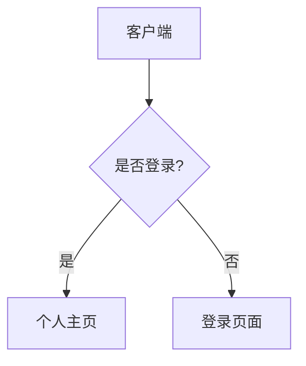

---
title:
  en: "Markdown Tutorial"
  zh: "Markdown 指南：从基础到 GitHub 开源贡献"
excerpt:
  en: "A comprehensive guide to Markdown syntax, editors, and advanced features."
  zh: "一份全面的 Markdown 语法、编辑器和高级功能指南。"
category: "tutorial"
readTime:
  en: "10 min read"
  zh: "10 分钟阅读"
author:
  en: "STYLAN"
  zh: "STYLAN"
tags: ["Markdown", "Tutorial", "Documentation"]
featured: false
---

# Markdown 指南：从基础到 GitHub 开源贡献

欢迎来到 Markdown 的世界！无论你是刚刚接触编程的开发者，还是准备在 GitHub 上大展拳脚参与开源项目的贡献者，掌握 Markdown 都是一项必不可少的技能。它能让你用纯文本快速排版，将精力集中在内容创作上。本教程将带你从最基础的语法起步，逐步掌握 GitHub 上的高级排版技巧。

## Markdown 基础语法（最常用）

### 1. 标题

Markdown 支持 1 到 6 级标题，使用 `#` 号表示，`#` 的数量代表标题的层级。

```markdown
# 一级标题

## 二级标题

### 三级标题

###### 六级标题
```

💡 **最佳实践**：在 `#` 和标题文字之间一定要保留一个空格，这是标准的 Markdown 语法。

### 2. 段落、换行与分割线

- **段落**：只需留下一个空行，就会生成一个新的段落。
- **换行**：在当前行的结尾输入**两个或以上的空格**，然后回车。
- **分割线**：使用三个以上的连续星号 `***` 或减号 `---`。

```Markdown
这是第一行。
这是第二行（上一行末尾有两个空格，实现了硬换行）。

这是另一个段落（上面有一个空行）。

---
上面是一条分割线。
```

### 3. 字体样式

你可以为文本添加加粗、斜体或删除线效果。

```Markdown
这是 **加粗** 的文字。
这是 *斜体* 的文字。
这是 ***加粗且斜体*** 的文字。
这是 ~~被删除~~ 的文字。
```

### 4. 列表

列表分为无序列表和有序列表，并且可以通过缩进实现嵌套。

```Markdown
- 无序列表项 1
- 无序列表项 2
  - 嵌套的子项目 (前面有两到四个空格)
  - 另一个子项目

1. 有序列表项 1
2. 有序列表项 2
   1. 嵌套的有序子项目
```

### 5. 链接

链接分为行内式和引用式。对于直接展示的 URL，大多数解析器也支持自动链接。

```Markdown
这是一个 [GitHub](https://github.com) 的行内链接。
这是一个引用链接：请参考 [Markdown 官网][1]。
[1]: [https://daringfireball.net/projects/markdown/](https://daringfireball.net/projects/markdown/)
直接使用 URL：[https://bing.com](https://bing.com)
```

### 6. 图片

图片的语法与链接类似，只是在最前面多了一个感叹号 `!`。你还可以为图片添加一个鼠标悬停时显示的“标题”。

```Markdown

```

**渲染结果：**


### 7. 引用

当你需要引用他人的话或者强调一段内容时，可以使用 `>`。引用可以嵌套，也可以包含其他 Markdown 元素（如列表或代码）。

```markdown
> 这是一段引用。
>
> > 这是嵌套的引用内容。
>
> - 引用中也可以使用列表。
```

### 8. 行内代码与代码块

代码是开发者文档的核心。行内代码使用单反引号包裹；多行代码块使用三个反引号包裹。

````Markdown
在终端中输入 `npm install` 来安装依赖。

下面是一段 JavaScript 代码：
```javascript
function greet(name) {
  console.log("Hello, " + name);
}
```
````

下面是一段 JavaScript 代码：

```JavaScript
function greet(name) {
  console.log("Hello, " + name);
}
```

💡 **最佳实践**：在使用代码块时，务必在第一行反引号后指定语言标识符（如 `javascript`, `python`, `bash` 等）。这不仅能触发语法高亮，还能让阅读者一目了然。

## GitHub 开源项目常见设计（GFM 特色）

GitHub Flavored Markdown (GFM) 扩展了基础语法，专门为代码托管和团队协作量身定制。

### 1. 任务列表

在开源项目中，常用于 Issue 或 Pull Request 的待办事项跟踪，勾选框直观展示进度。

Markdown

```markdown
- [x] 完善文档结构
- [x] 修复首页 Bug
- [ ] 编写测试用例
```

**渲染结果：**

- [x] 完善文档结构
- [x] 修复首页 Bug
- [ ] 编写测试用例

### 2. 表格

用于有条理地展示参数说明或数据对比。使用 `:` 可以控制对齐方式。

```Markdown
| 左对齐 | 居中对齐 | 右对齐 |
| :--- | :---: | ---: |
| 参数 A | `string` | 必填 |
| 参数 B | `number` | 选填 |
```

**渲染结果：**

| **左对齐** | **居中对齐** | **右对齐** |
| ---------- | ------------ | ---------- |
| 参数 A     | `string`     | 必填       |
| 参数 B     | `number`     | 选填       |

💡 **最佳实践**：对齐符 `-` 的数量不限，但至少需要一个。建议保持代码层面的对齐以提高源码可读性。

### 3. 脚注

用于补充说明，而不会打断主干内容的阅读。在 GitHub 的 Markdown 中已被广泛支持。

```markdown
这是一个需要解释的专业术语[^1]。

[^1]: 这里是对该术语的详细解释和补充说明。
```

**渲染结果：**

这是一个需要解释的专业术语[^1]。

[^1]: 这里是对该术语的详细解释和补充说明。

### 4. 自动链接与 Emoji

GitHub 会自动将纯文本的网址或邮箱识别为链接。同时，通过特定的简写可以快速输入表情符号，增加交流的亲和力。

```Markdown
访问我的博客：https://example.com
你好呀！ :smile: :rocket:
```

**渲染结果：** 访问我的博客：[https://example.com](https://example.com) 你好呀！ :smile: :rocket:

### 5. 提及与引用

GitHub 特有的社交与版本控制协作语法。

- `@username`：通知某位开发者。
- `#123`：链接到当前仓库的第 123 号 Issue 或 PR。
- `a1b2c3d`：直接写出 commit hash，GitHub 会自动将其转换为指向该提交的链接。

**渲染效果：** _（这些特性无需额外语法，直接在文本中输入即可被 GitHub 解析器捕获。）_

### 6. 徽章（Badge）

在 `README.md` 中，项目通常会使用徽章展示构建状态、License 等。通常结合 `shields.io` 使用。

```markdown

```

**渲染结果：** _(会显示一个蓝色背景，白字的 MIT 协议小徽章标签)_


**说明**：徽章本质上就是一张在线生成的图片(运用了前面的图片语法)，通过参数改变文字和颜色。

### 7. 折叠块（Details）

开源项目的 README 有时会非常长，使用折叠块可以隐藏大段的日志、配置代码或 Q&A。

````markdown
<details>
  <summary>点击查看详细配置代码</summary>
  
  ```json
  {
    "version": "1.0.0",
    "description": "Awesome project"
  }
  ```
````

**渲染结果：** ▶ 点击查看详细配置代码 _(点击后展开内部的代码块)_

### 8. 关于 HTML 的建议

GitHub 允许使用部分安全的 HTML 标签（如 `<kbd>` 键位说明、`<br>` 强制换行、`<details>` 等）。

**建议**：除非 Markdown 无法实现（如折叠块、居中对齐、特定颜色），否则尽量使用纯 Markdown，以保证文档在不同平台间的最佳可移植性。

## 进阶技巧（不常用的扩展内容）

### 1. 数学公式

使用 `LaTeX` 语法编写数学公式。GitHub 目前已经原生支持。行内使用 `$公式$`，块级使用 `$$公式$$`。

```markdown
著名的质能方程是 $E = mc^2$。

$$
\int_0^\infty e^{-x^2} dx = \frac{\sqrt{\pi}}{2}
$$
```

**渲染结果：**

$$
\int_0^\infty e^{-x^2} dx = \frac{\sqrt{\pi}}{2}
$$

### 2. 图表（Mermaid）

使用代码的方式绘制图表，GitHub 已经原生支持 Mermaid 语法。常用于流程图或架构图。

````txt

````

**渲染结果：**


### 3. 内部锚点与跳转

用于长文档内部跳转。通常，GitHub 会为所有的标题自动生成不可见的锚点（将标题转为小写并用 `-` 替换空格）。

```markdown
点击这里跳回到 [顶部目录](#目录)。
或者使用 HTML 设置自定义锚点 <a name="my-anchor"></a>
```

**渲染结果：**[顶部目录](#Markdown 基础语法（最常用）)

### 4. 警告块（Admonitions）

在文档中用来吸引读者注意力的特殊区块。GitHub 近期正式推出了支持。

```markdown
> [!NOTE]
> 这是一个提示信息，告诉你一些有用的背景知识。

> [!WARNING]
> 这是一个警告信息，提醒你需要注意的潜在风险。
```

### 5. 其他特定解析器扩展

- **定义列表**：`术语 \n : 释义`（部分解析器支持，GFM 不原生支持）。
- **上下标**：使用 `^上标^` 和 `~下标~`（建议直接使用 HTML 的 `<sup>` 和 `<sub>` 以保兼容）。
- **高亮标记**：使用 `==高亮内容==`（需 Typora 或 Markdown Preview Enhanced 等插件支持）。

## 推荐阅读与工具

现在你已经掌握了 Markdown 的核心武功秘籍！理论结合实践才能炉火纯青，以下是一些强烈推荐的资源：

- **官方与权威规范**：
  - [GitHub Flavored Markdown (GFM) 官方文档](https://github.github.com/gfm/) - 编写开源项目文档的终极参考。
  - [Markdown 官方语法指南 (John Gruber)](https://www.markdownguide.org/) - Markdown 创始人的原始文档。
- **推荐编辑器**：
  - [VS Code](https://code.visualstudio.com/) - 搭配插件极其强大，开发者首选。
  - [Typora](https://typora.io/) - 极致的“所见即所得” Markdown 写作体验。
  - [Obsidian](https://obsidian.md/) - 基于 Markdown 的网状知识管理工具。
- **在线练习与工具**：
  - [Dillinger](https://dillinger.io/) - 在线的 Markdown 编辑和实时预览器。
  - [Shields.io](https://shields.io/) - 为你的开源项目制作专属 Badge 徽章。

现在，打开你的编辑器，创建一个 `README.md`，开始你的创作与开源之旅吧！
